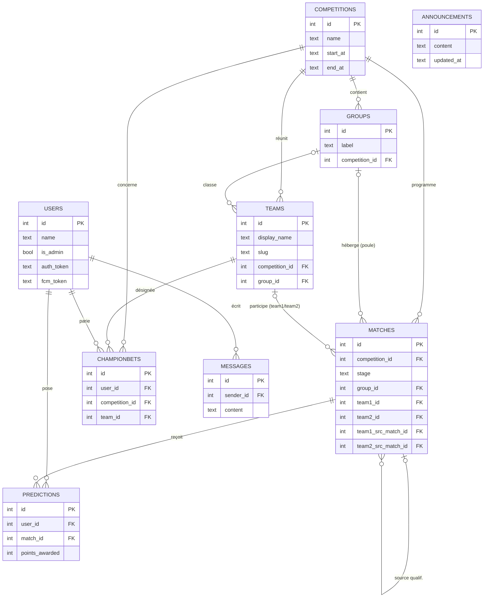

# Modèle de données

> Schéma de la base **SQLite** du backend. Complète le
> [cahier des charges fonctionnel](./cahier-des-charges.md) et la [stack technique](./stack-technique.md).
>
> Schéma v1 — **9 tables**.

## Conventions de nommage

- **Tables** : `camelCase`, initiale minuscule (ex. `users`, `championBets`).
- **Colonnes** : `snake_case`, initiale minuscule (ex. `is_admin`, `created_at`).
- Booléens stockés en `0/1`, dates en texte ISO 8601 (SQLite).

## Tables

- `users` — les joueurs
- `competitions` — les compétitions
- `teams` — les équipes / sélections
- `groups` — les poules
- `matches` — les matchs
- `predictions` — les pronos de match
- `championBets` — les paris sur le vainqueur du tournoi
- `messages` — le chat global
- `announcements` — le message d'accueil de l'organisateur (singleton)

## Schéma relationnel

**Relations (rappel textuel) :**
- `competitions` → possède plusieurs `groups`, `teams`, `matches`, `championBets`.
- `groups` → classe des `teams` et héberge des `matches` de poule (liens *optionnels* : `group_id` nullable).
- `teams` → participe aux `matches` (via `team1_id`/`team2_id`, *optionnels* en élim directe) et est désignée dans des `championBets`.
- `matches` → reçoit des `predictions` ; **se référence lui-même** pour la provenance du bracket
  (`team1_src_match_id`/`team2_src_match_id` = vainqueur/perdant d'un autre match). Provenance aussi
  possible depuis une poule (`team1_src_group_id`/`team2_src_group_id`, non dessinée pour la lisibilité).
- `users` → pose des `predictions`, des `championBets`, écrit des `messages`.
- `announcements` → **autonome** (message d'accueil unique, sans clé étrangère, non dessiné).

---

## `users` — les joueurs

Un enregistrement par joueur. Identité sans compte (pseudo seul), rôle, et éléments de notification.

| Colonne | Type | Contrainte | Rôle |
|---|---|---|---|
| `id` | INTEGER | PK, auto-incrément | Identifiant interne. |
| `name` | TEXT | NOT NULL | Pseudo affiché, saisi à la première ouverture. |
| `is_admin` | BOOLEAN | NOT NULL, défaut `0` | Autorise la saisie des résultats. |
| `notif_enabled` | BOOLEAN | NOT NULL, défaut `0` | Interrupteur **global** des notifications push. |
| `reminder_notif_enabled` | BOOLEAN | NOT NULL, défaut `0` | Rappels **avant match** (1 h / 15 min). |
| `score_notif_enabled` | BOOLEAN | NOT NULL, défaut `0` | Notification de **score** après match (désactivable pour éviter le spoil). |
| `announcement_notif_enabled` | BOOLEAN | NOT NULL, défaut `0` | Notification des **annonces de l'organisateur** (message d'accueil). |
| `auth_token` | TEXT | NOT NULL, UNIQUE | Secret d'identification (« login sans login ») : généré à la création, stocké sur l'appareil, présenté à chaque requête. Sert aussi de **clé de récupération** pour se reconnecter sur un nouvel appareil (route `/login`). |
| `fcm_token` | TEXT | *nullable* | Jeton Firebase Cloud Messaging pour l'envoi des push Android (peut changer / être absent). |
| `created_at` | DATETIME | NOT NULL, défaut *maintenant* | Date d'inscription. |

## `competitions` — les compétitions

Une compétition gérée par l'app (permet l'archivage multi-tournois). Les autres tables la référencent
via `competition_id`.

| Colonne | Type | Contrainte | Rôle |
|---|---|---|---|
| `id` | INTEGER | PK, auto-incrément | — |
| `name` | TEXT | NOT NULL | Ex. « Ligue des Nations 2027 ». |
| `start_at` | DATETIME | NOT NULL | Début (affichage / repère). |
| `end_at` | DATETIME | *nullable* | Fin — souvent inconnue à la création. |

**Déduit, donc pas de colonne dédiée :**
- **Statut** (`à venir` / `en cours` / `terminée`) : début = 1er coup d'envoi passé (`MIN(kickoff_at)`) ;
  fin = résultat de la **finale** saisi. Entièrement dérivable, donc **pas** de colonne `status`
  (elle existait mais n'était lue nulle part → supprimée pour éviter toute divergence).
- Verrou du pari « vainqueur du tournoi » = `MIN(kickoff_at)` des `matches` de la compétition.
- Vainqueur réel de la compétition = vainqueur de la finale dans `matches`.

## `teams` — les équipes / sélections

Une équipe nationale participant à une compétition donnée.

| Colonne | Type | Contrainte | Rôle |
|---|---|---|---|
| `id` | INTEGER | PK, auto-incrément | — |
| `display_name` | TEXT | NOT NULL | Nom affiché (ex. `France`). |
| `slug` | TEXT | NOT NULL | Nom technique (ex. `france`), sert au chemin d'asset du drapeau : `assets/flags/<slug>.png`. |
| `competition_id` | INTEGER | FK → `competitions`, NOT NULL | Conservé même si `group_id` existe (car `group_id` peut être nul). |
| `group_id` | INTEGER | FK → `groups`, *nullable* | Poule d'appartenance. Nul si compétition sans poules ou équipe non encore affectée. |

**Non stocké (calculé depuis `matches`) :** classement de poule, points, goal-average.

**Drapeaux (assets) :** un fichier par équipe, `assets/flags/<slug>.png`. Convention volontairement
**sans `competition_id`** dans le nom : un drapeau change très rarement d'une compétition à l'autre, donc
coupler au `competition_id` créerait surtout des doublons identiques. Les drapeaux de **toutes les
sélections nationales** (membres FIFA) sont **pré-embarqués** — nommer une équipe avec le bon `slug`
(minuscules, sans diacritique ni caractère non alphanumérique) suffit, **sans republier d'APK**. Le jeu
d'assets est régénérable via `frontend/scripts/download-flags.mjs` (source flagcdn). Dans le cas rare où un pays change
de drapeau, on stocke la nouvelle version en `assets/flags/<slug>_2.png` (`_3`, etc.) et la compétition
concernée pointera vers cette version (indicateur à ajouter le moment venu — non nécessaire tant qu'il n'y
a qu'une version).

## `groups` — les poules

Une poule de la phase de groupes. Référencée par `teams.group_id`, sert au câblage du bracket.

| Colonne | Type | Contrainte | Rôle |
|---|---|---|---|
| `id` | INTEGER | PK, auto-incrément | — |
| `label` | TEXT | NOT NULL | Identifiant court : `A`, `B`… Affichage (« Groupe A ») et seeding du bracket. |
| `competition_id` | INTEGER | FK → `competitions`, NOT NULL | — |

**Non stocké (calculé depuis `matches`) :** classement, points, goal-average, ordre des équipes.
Le préfixe « Groupe » est ajouté par l'affichage, pas stocké.

## `matches` — les matchs

Un match de la compétition (poule ou élimination directe), avec programmation, participants et résultat.
Les participants d'un match à élimination directe peuvent être **inconnus** au départ : ils sont alors
décrits par leur **provenance** (`*_src_*`) et résolus automatiquement quand le match/la poule source
est terminé (auto-remplissage du bracket, cf. cahier des charges §10).

**Identité & programmation**

| Colonne | Type | Contrainte | Rôle |
|---|---|---|---|
| `id` | INTEGER | PK, auto-incrément | — |
| `competition_id` | INTEGER | FK → `competitions`, NOT NULL | Rattachement (indispensable car `group_id` est nul en élim directe). |
| `stage` | TEXT | NOT NULL | `poule` / `seizieme` / `huitieme` / `quart` / `demie` / `petite_finale` / `finale`. |
| `group_id` | INTEGER | FK → `groups`, *nullable* | Seulement si `stage = poule`. |
| `kickoff_at` | DATETIME | NOT NULL | Coup d'envoi : verrou des pronos (`now ≥ kickoff_at`) + déclenche les notifs. |
| `status` | TEXT | NOT NULL, défaut `'scheduled'` | `scheduled` / `finished` (résultat saisi et points calculés). |

**Participants (résolus + provenance)**

| Colonne | Type | Contrainte | Rôle |
|---|---|---|---|
| `team1_id` | INTEGER | FK → `teams`, *nullable* | `NULL` tant que le participant n'est pas connu. |
| `team2_id` | INTEGER | FK → `teams`, *nullable* | idem. |
| `team1_src_type` | TEXT | *nullable* | `group_position` / `match_winner` / `match_loser`. |
| `team1_src_group_id` | INTEGER | FK → `groups`, *nullable* | Si `group_position`. |
| `team1_src_rank` | INTEGER | *nullable* | Si `group_position` (1 = 1ᵉʳ de poule…). |
| `team1_src_match_id` | INTEGER | FK → `matches`, *nullable* | Si `match_winner` / `match_loser`. |
| `team2_src_type` | TEXT | *nullable* | idem team1. |
| `team2_src_group_id` | INTEGER | FK → `groups`, *nullable* | idem. |
| `team2_src_rank` | INTEGER | *nullable* | idem. |
| `team2_src_match_id` | INTEGER | FK → `matches`, *nullable* | idem. |

**Résultat**

| Colonne | Type | Contrainte | Rôle |
|---|---|---|---|
| `score1` | INTEGER | *nullable* | Score équipe 1, **à la 120ᵉ** en élim directe (90ᵉ en poule). |
| `score2` | INTEGER | *nullable* | Score équipe 2. |
| `penalty_score1` | INTEGER | *nullable* | Tirs au but équipe 1 (seulement si nul à la 120ᵉ en élim directe). |
| `penalty_score2` | INTEGER | *nullable* | Tirs au but équipe 2. |

**Cotes figées** (snapshot au coup d'envoi ; `NULL` avant). Figées pour protéger l'historique des
changements de barème (§13). Avant le coup d'envoi, les cotes affichées sont calculées à la volée.

| Colonne | Type | Contrainte | Rôle |
|---|---|---|---|
| `odds_team1` | INTEGER | *nullable* | Cote figée de l'issue « équipe 1 gagne ». |
| `odds_draw` | INTEGER | *nullable* | Cote figée de l'issue « nul » (élim directe : passage aux tirs au but). |
| `odds_team2` | INTEGER | *nullable* | Cote figée de l'issue « équipe 2 gagne ». |

**Non stocké (calculé) :** issue A/nul/B, équipe qualifiée.
`match_loser` sert à la **petite finale** (les deux perdants des demies).

**Confrontations en aller-retour** (certaines compétitions, ex. LDN 2027) : chaque manche est une ligne
`matches` (on pronostique chaque manche). Une colonne `first_leg_match_id` (FK → `matches`, *nullable*)
sur la **manche retour** pointe vers la **manche aller** (`NULL` = confrontation à match unique). Le
vainqueur d'une confrontation se calcule au **cumul** des deux manches ; à égalité de cumul après le
retour, **t.a.b. du match retour** (pas de règle du but à l'extérieur). La provenance aval
(`match_winner`/`match_loser`) pointe vers la **manche retour**. Auto-remplissage : `util/autofill.js`.

## `predictions` — les pronos de match

Un prono de score par joueur et par match. Modifiable jusqu'au coup d'envoi.

| Colonne | Type | Contrainte | Rôle |
|---|---|---|---|
| `id` | INTEGER | PK, auto-incrément | — |
| `user_id` | INTEGER | FK → `users`, NOT NULL | — |
| `match_id` | INTEGER | FK → `matches`, NOT NULL | — |
| `predicted_score1` | INTEGER | NOT NULL | Score parié pour l'équipe 1. |
| `predicted_score2` | INTEGER | NOT NULL | Score parié pour l'équipe 2. |
| `points_awarded` | INTEGER | *nullable* | Points gagnés, figés quand le match passe `finished` (`NULL` avant). |
| `created_at` | DATETIME | NOT NULL, défaut *maintenant* | — |
| `updated_at` | DATETIME | NOT NULL, défaut *maintenant* | Mis à jour à chaque modification (avant coup d'envoi). |

**Contrainte : `UNIQUE(user_id, match_id)`** — la vraie garantie « un seul prono par joueur et par
match » (les clés étrangères, elles, ne garantissent que l'existence des lignes référencées).

**Non stocké :** issue A/nul/B (déduite de `predicted_score1/2`), cotes (sur `matches`),
`competition_id` (via `match_id`), tirs au but (le pari porte sur le score à la 120ᵉ).

## `championBets` — les paris sur le vainqueur du tournoi

Un pari « équipe championne » par joueur et par compétition. Modifiable jusqu'au coup d'envoi du
premier match.

| Colonne | Type | Contrainte | Rôle |
|---|---|---|---|
| `id` | INTEGER | PK, auto-incrément | — |
| `user_id` | INTEGER | FK → `users`, NOT NULL | — |
| `competition_id` | INTEGER | FK → `competitions`, NOT NULL | — |
| `team_id` | INTEGER | FK → `teams`, NOT NULL | Équipe désignée championne. |
| `points_awarded` | INTEGER | *nullable* | Bonus figé à la fin (0 ou 200). |
| `created_at` | DATETIME | NOT NULL, défaut *maintenant* | — |
| `updated_at` | DATETIME | NOT NULL, défaut *maintenant* | Dernière modification (avant verrou). |

**Contrainte : `UNIQUE(user_id, competition_id)`** — un pari par joueur et par compétition.

**Non stocké :** « a-t-il gagné » (comparaison de `team_id` au vainqueur de la finale).

## `messages` — le chat global

Un message du chat commun unique. Périmètre v1 : **chat global uniquement** (pas de DM ni de groupes).
Comme il n'existe qu'un seul chat, aucun rattachement à une conversation n'est nécessaire.

| Colonne | Type | Contrainte | Rôle |
|---|---|---|---|
| `id` | INTEGER | PK, auto-incrément | — |
| `sender_id` | INTEGER | FK → `users`, NOT NULL | Auteur du message. |
| `content` | TEXT | NOT NULL | Texte du message. |
| `created_at` | DATETIME | NOT NULL, défaut *maintenant* | Date d'envoi. |

*Extension future (hors périmètre) : messagerie privée / groupes → introduire une table
`conversations` + `conversationMembers` et ajouter `conversation_id` ici. Aucune donnée existante à migrer.*

## `announcements` — le message d'accueil de l'organisateur

Le **message d'accueil** unique affiché en tête de l'écran d'accueil, éditable par l'admin depuis
l'espace admin. Traité en **singleton** : une seule ligne (`id = 1`), créée au démarrage avec un
placeholder non vide, puis mise à jour en place (jamais d'insertion supplémentaire).

| Colonne | Type | Contrainte | Rôle |
|---|---|---|---|
| `id` | INTEGER | PK, auto-incrément | Toujours `1` (ligne unique). |
| `content` | TEXT | NOT NULL | Texte du message affiché sur l'accueil. |
| `updated_at` | DATETIME | NOT NULL, défaut *maintenant* | Dernière modification par l'admin. |

**Indépendante de toute compétition** (message global, hors classement) : aucune clé étrangère.
